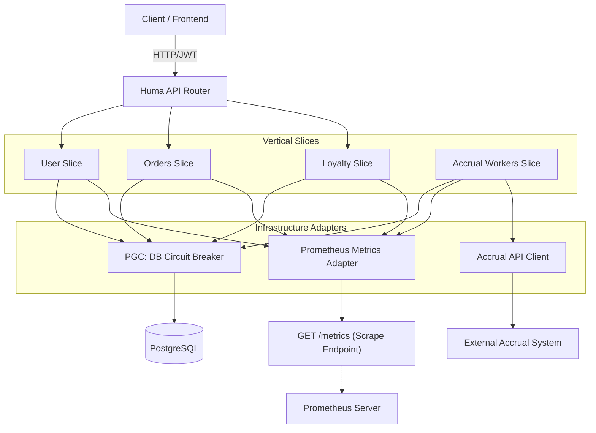

# GopherMart — Накопительная система лояльности


Данный проект является **учебным** и представляет собой реализацию серверной части системы лояльности. Разработка велась в строгом соответствии с [Техническим заданием (ТЗ)](./SPECIFICATION.md), которое описывает бизнес-требования к регистрации пользователей, обработке заказов и расчету бонусных баллов.

---

# Архитектура проекта

Проект сочетает автономность вертикальных слайсов и надежность гексагональных адаптеров.

## Самодокументируемый API (HUMA v2)
Выбор фреймворка **HUMA** продиктован необходимостью быстрой и гибкой разработки API. HUMA автоматически генерирует OpenAPI 3.1 спецификацию (доступна по адресу `/docs`), обеспечивая строгую валидацию DTO на основе типов Go.
- **Type-safe контракты**: Ошибки в схеме данных выявляются на этапе компиляции.
- **Автогенерация OpenAPI 3.1**: Актуальная документация Swagger всегда доступна по адресу `/docs`.
- **Validation**: Автоматическая проверка входных данных (DTO) на основе тегов структур.

## Гексагональная архитектура
Проект реализует принцип **Ports and Adapters**:
- **Internal Domain**: «Сердце» системы, содержит чистые бизнес-сущности.
- **Adapters**: Вынесенные инфраструктурные компоненты (PostgreSQL, Accrual Client, Prometheus).
- **Dependency Inversion**: Сервисы определяют интерфейсы (порты), а `serve.go` (Composition Root) внедряет зависимости.

## Вертикальные слайсы (Vertical Slices)
Приложение разделено на функциональные блоки. Каждый слайс инкапсулирует свою логику, SQL-запросы и специфичные метрики:
- **User**: Регистрация и JWT-аутентификация.
- **Orders**: Управление жизненным циклом заказов.
- **Loyalty**: Операции с балансом и списаниями.
- **Accrual Workers**: Фоновая обработка очереди начислений (автономный слайс).


Каждый слайс содержит в себе всё необходимое для работы (Handlers, Service, Repository), что минимизирует связи между модулями.

## Инфраструктурные Адаптеры (Adapters)
Слой `internal/adapters` реализует интерфейсы (порты), необходимые слайсам:
- **PGC (Circuit Breaker)**: Умная прослойка над БД. Защищает PostgreSQL от каскадных сбоев, переводя доступ в Offline при деградации производительности.
- **Accrual Client**: Адаптер для взаимодействия с внешней HTTP-системой.
- **Prometheus Metrics**: Адаптер телеметрии, собирающий данные со всех слоев приложения.


# Схема




# Реализованные эндпоинты

## Аутентификация
- `POST /api/user/register` — Регистрация нового пользователя.
- `POST /api/user/login` — Аутентификация пользователя.

## Заказы
- `POST /api/user/orders` — Загрузка номера заказа для расчета.
- `GET /api/user/orders` — Получение списка загруженных заказов.

## Лояльность
- `GET /api/user/balance` — Получение текущего баланса и суммы списаний.
- `POST /api/user/balance/withdraw` — Запрос на списание баллов в счет заказа.
- `GET /api/user/withdrawals` — История списаний пользователя.

## Системные
- `GET /metrics` — Метрики в формате Prometheus (сбор данных по Pull-модели).
- `GET /docs` — Интерактивная документация Swagger/OpenAPI.

# Запуск проекта

```bash
make build
make up
make logs
```

## Тестирование
Проект покрыт Unit и интеграционными тестами.

```bash
make test
make cover
```
