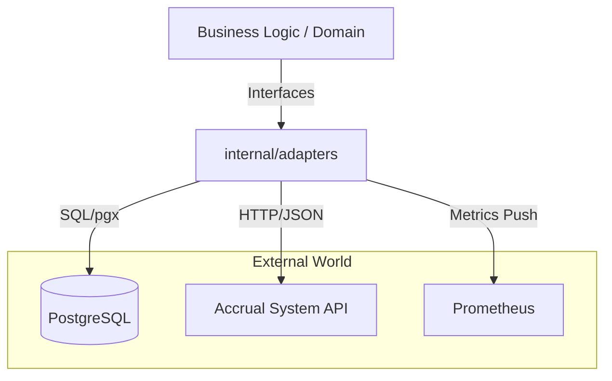

# Adapters Layer (Infrastructure)

Директория `internal/adapters` содержит реализацию всех внешних взаимодействий сервиса. В соответствии с гексагональной архитектурой, бизнес-логика (Domain/Usecases) не знает о деталях реализации внешних систем и общается с ними исключительно через интерфейсы, реализованные здесь.

## Архитектурная роль

Все модули проекта взаимодействуют с «внешним миром» через адаптеры. Это изолирует ядро приложения от изменений в сторонних API, специфики драйверов баз данных или протоколов мониторинга.

## Состав слоя адаптеров

### 1. Accrual Client (`/accrual`)
HTTP-клиент для интеграции с внешней системой расчета баллов лояльности.
- **Особенности**: Поддержка `Retry-After` из HTTP-заголовков, автоматическая обработка статус-кодов и типизация ответов в доменные структуры.

### 2. Metrics (`/metrics`)
Адаптер для сбора телеметрии с использованием Prometheus.
- **Особенности**: Разделение на подсистемы (Auth, Loyalty, Orders, Workers, PG), кастомные гистограммы для замера латентности и мониторинг ошибок бизнес-логики.

### 3. PostgreSQL Connector (`/pgc`)
Продвинутая обертка над драйвером `pgx` для надежной работы с базой данных.
- **Особенности**: 
    - **Circuit Breaker**: Автоматическое отключение (Offline) проблемных инстансов БД для предотвращения каскадных сбоев.
    - **Self-Healing**: Механизм `CanTry`, позволяющий одной горутине проверять статус БД в фоновом режиме.
    - **Safe Transactions**: Автоматический `Rollback` при паниках внутри коллбэков и поддержка контекстов без отмены (`WithoutCancel`) для завершения фиксации данных.

## Принципы разработки
1. **Изоляция**: Адаптеры не содержат бизнес-логику, только логику взаимодействия (ретрансляция ошибок, ретраи, маппинг данных).
2. **Тестируемость**: Для каждого адаптера генерируются моки (через `mockgen`), что позволяет тестировать бизнес-логику без поднятия реальной инфраструктуры.
3. **Наблюдаемость**: Каждый адаптер обязан рапортовать о своем состоянии (ошибки, задержки) через модуль метрик.
