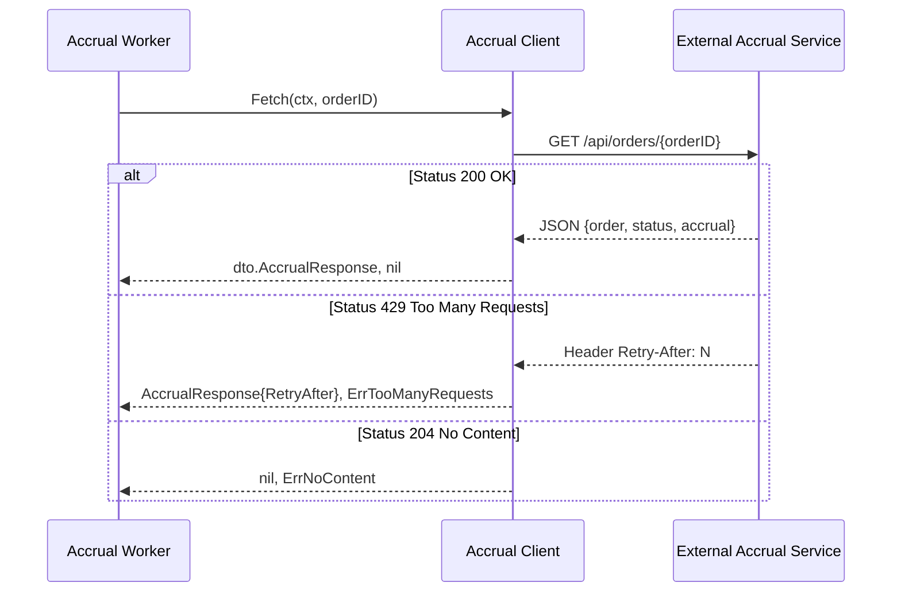

# Accrual Adapter

Модуль `internal/adapters/accrual` представляет собой HTTP-клиент для взаимодействия с внешней системой расчета вознаграждений (Accrual System).

## Назначение
Клиент отвечает за получение актуального статуса обработки заказа и суммы начисленных баллов лояльности. Поддерживает обработку специфичных для API состояний, таких как ограничение частоты запросов (Rate Limiting).

## Схема взаимодействия



## Особенности реализации

- **Управление ресурсами**: Применяется `io.Copy(io.Discard, resp.Body)` для обеспечения переиспользования TCP-соединений (Keep-Alive).
- **Rate Limiting**: При получении HTTP 429 адаптер извлекает значение `Retry-After` из заголовка. Если заголовок отсутствует, по умолчанию устанавливается задержка в 60 секунд.
- **Типизация**: Используются доменные типы `domain.OrderNumber` и `domain.Amount`, что предотвращает передачу некорректных данных на уровне компиляции.
- **Тайм-ауты**: Настроен базовый таймаут в 10 секунд на уровне `http.Client`.

## Ошибки
- `ErrNoContent`: Заказ не зарегистрирован в системе начислений.
- `ErrTooManyRequests`: Превышен лимит запросов, требуется пауза.
- `ErrInternalError`: Внутренняя ошибка удаленного сервиса.

## Пример использования

```go
u, _ := url.Parse("http://localhost:8080")
client := accrual.NewClient(u)

resp, err := client.Fetch(ctx, orderID)
if errors.Is(err, accrual.ErrTooManyRequests) {
    time.Sleep(resp.RetryAfter)
}
```
