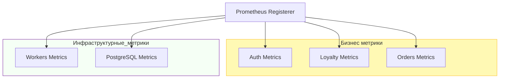

# Metrics Adapter (Prometheus)

Пакет `internal/adapters/metrics` отвечает за сбор, регистрацию и предоставление телеметрии всего сервиса GopherMart. Он разделен на логические подсистемы для удобства масштабирования и чистоты кода.

## Архитектура пакета



## Подсистемы и метрики

### 1. Auth (Авторизация)
Отвечает за безопасность и производительность криптографии.
- ```gmart_auth_login_errors_total```: Ошибки входа с разбивкой по причинам (invalid_password, user_not_found).
- ```gmart_auth_bcrypt_duration_seconds```: Гистограмма времени хеширования (критично для CPU).

### 2. Loyalty (Лояльность)
Отслеживает финансовые потоки и баланс.
- ```gmart_loyalty_withdrawals_total```: Количество попыток списания баллов.
- ```gmart_loyalty_withdrawal_amount_cents```: Распределение сумм списаний в копейках.
- ```gmart_loyalty_db_operation_duration_seconds```: Латентность БД в контексте программы лояльности.

### 3. Orders (Заказы)
Мониторинг жизненного цикла заказов.
- ```gmart_orders_upload_total```: Статистика загрузки новых заказов.
- ```gmart_orders_list_size_rows```: Размер возвращаемых списков заказов.
- ```gmart_orders_finalized_total```: Счётчик заказов, перешедших в статусы PROCESSED или INVALID.

### 4. Workers (Внешние интеграции)
Контроль взаимодействия с системой Accrual.
- ```gmart_worker_processed_items_total```: Результаты итераций воркера (success, timeout, rate_limit).
- ```gmart_worker_accrual_request_duration_seconds```: Латентность внешнего API.
- ```gmart_worker_rate_limit_hits_total```: Счётчик HTTP 429 ошибок.

### 5. PostgreSQL (Инфраструктура)
Детальный мониторинг состояния экземпляров БД.
- ```gmart_postgresql_pg_instance_ready```: Статус доступности (1 - Online, 0 - Offline).
- ```gmart_postgresql_pg_instance_duration_seconds```: Время выполнения низкоуровневых операций (Query, Exec, Tx).
- ```gmart_postgresql_pg_instance_retries_total```: Количество повторных попыток при сбоях.

## Особенности реализации

- **Типизация операций**: Используется общий тип ```OpType``` (query, exec, bcrypt и др.) для унификации меток во всех метриках.
- **Fail-Fast регистрация**: Применение ```reg.MustRegister(...)``` гарантирует, что приложение не запустится с некорректной конфигурацией метрик.
- **Оптимизированные бакеты**: Для каждой подсистемы подобраны свои интервалы (Buckets) — от миллисекунд для БД до секунд для внешних HTTP-вызовов.

## Генерация моков
Для тестирования компонентов, зависящих от метрик, предусмотрена генерация мока для интерфейса Prometheus:
```bash
go generate ./internal/adapters/metrics/...
```
