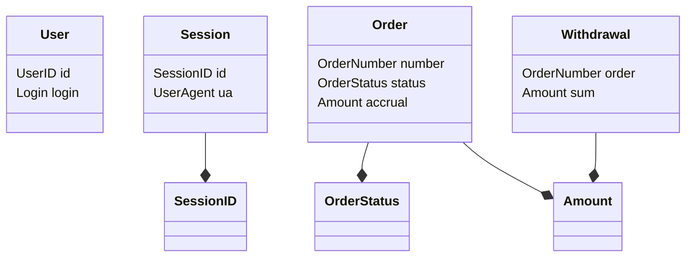

# Domain Layer (Ядро системы)

В данном пакете сосредоточены основные бизнес-сущности, типы данных и константы, которые определяют логику работы системы лояльности. Этот слой является **"чистым"**: он не зависит от фреймворков (Huma), баз данных (PGX) или внешних протоколов.

## Философия домена

Мы используем **строгую типизацию** (Value Objects) вместо базовых типов (`string`, `int64`). Это позволяет:
1.  **Избежать ошибок**: Вы не сможете случайно передать `Password` в функцию, ожидающую `Login`.
2.  **Инкапсулировать логику**: Такие типы, как `Amount`, сами знают, как правильно маршалиться в JSON (из копеек в рубли).
3.  **Улучшить читаемость**: Сигнатуры функций типа `Withdraw(UserID, OrderNumber, Amount)` самодокументированы.

## Состав компонентов

### 1. Идентификация и безопасность
*   [**login.go**](./login.go), [**password.go**](./password.go): Базовые типы для учетных записей.
*   [**user_id.go**](./user_id.go): Типизированный ID пользователя (`int64`).
*   [**token.go**](./token.go): JWT-токен доступа.
*   [**session_id.go**](./session_id.go): UUID сессии с поддержкой автоматического парсинга из Cookie через `UnmarshalText`.

### 2. Финансы и расчеты
*   [**amount.go**](./amount.go): **Критически важный компонент**. Реализует арифметику с фиксированной точкой (Fixed-point). Хранит деньги в `uint64` (копейки), исключая ошибки округления `float64`. Содержит кастомную логику JSON для отображения пользователю рублей с двумя знаками после запятой.

### 3. Заказы и начисления
*   [**order.go**](./order.go): Агрегат данных заказа (номер, статус, сумма, дата).
*   [**order_number.go**](./order_number.go): Номер заказа, проходящий через валидацию алгоритмом Луна.
*   [**order_status.go**](./order_status.go) & [**status.go**](./status.go): Машина состояний заказа (`NEW`, `PROCESSING`, `INVALID`, `PROCESSED`).

### 4. История операций
*   [**withdrawal.go**](./withdrawal.go): Структура для фиксации списания баллов.

## Схема зависимостей типов

## Интеграция
Доменные модели используются всеми вертикальными слайсами:
*   **User Slice**: Работает с `Login`, `Password`, `SessionID`.
*   **Orders Slice**: Работает с `OrderNumber` и `OrderStatus`.
*   **Loyalty Slice**: Активно использует `Amount` и `Withdrawal`.

