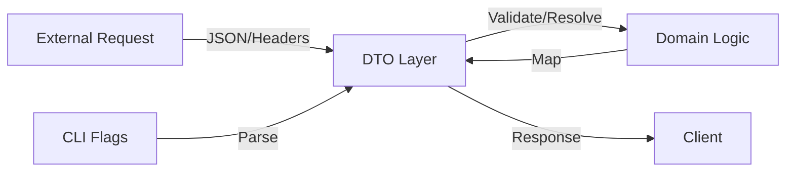

# Data Transfer Objects (DTO)

Пакет ```internal/dto``` содержит структуры данных, используемые для передачи информации между внешними интерфейсами (API, CLI) и внутренними сервисами приложения.

## Назначение
DTO служат буфером, который защищает доменную логику от изменений во внешних API и позволяет на раннем этапе валидировать входящие данные.

## Основные компоненты



## Состав модуля

### 1. Аутентификация (```AuthInput```)
Объект для захвата учетных данных из разных источников:
- **Header**: ```Authorization``` (Bearer-токен).
- **Cookie**: ```session_id```.
- **Validation**: Использует встроенный ```huma.Resolver``` для проверки наличия хотя бы одного способа авторизации до того, как запрос попадет в обработчик.

### 2. Конфигурация (```CLIOptions```)
Структура для парсинга параметров запуска приложения.
- Поддерживает значения по умолчанию.
- Описывает соответствие флагов командной строки (short/long) и переменных окружения.

### 3. Внешние системы (```AccrualResponse```)
Описывает формат данных, приходящих от сервиса начислений.
- Маппит внешние поля JSON на внутренние типы данных (```OrderNumber```, ```Amount```).
- Хранит служебную информацию, такую как ```RetryAfter```, скрытую от JSON-сериализации.

## Принципы работы
1. **Валидация**: DTO реализуют интерфейсы валидации (например, Huma Resolver), что позволяет отсекать некорректные запросы на границе системы.
2. **Изоляция**: Поля DTO могут содержать теги для специфических библиотек (```json```, ```header```, ```doc```), которые не должны проникать в пакет ```internal/domain```.
3. **Преобразование**: Объекты DTO легко конвертируются в доменные модели и обратно, обеспечивая чистоту архитектуры.
