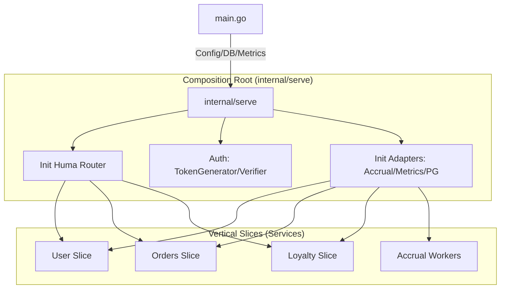
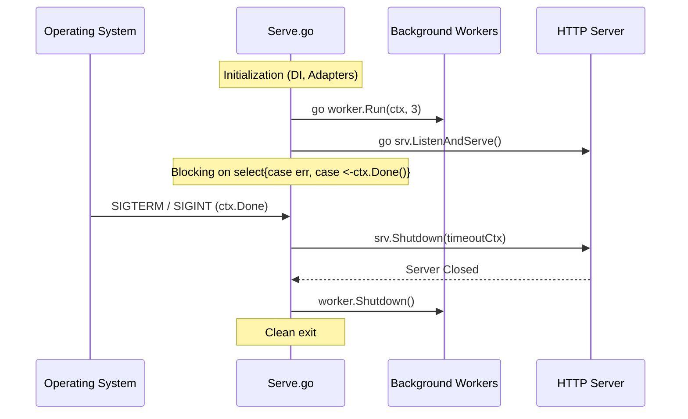

# Internal Serve

Пакет `serve` является **Composition Root** (композиционным узлом) приложения. Он превращает статичную конфигурацию в живой сервис, связывая адаптеры, доменную логику и инфраструктуру.

## Архитектурная схема



## Роль в архитектуре

В рамках **Vertical Slice Architecture**, пакет `serve` выполняет роль глобального оркестратора:

1.  **Dependency Injection (DI)**: Здесь происходит инициализация графа зависимостей. Мы создаем экземпляры репозиториев, клиентов внешних систем и сервисов, передавая их "вверх" по цепочке.
2.  **Infrastructure Setup**: Конфигурация HTTP-сервера (таймауты, адреса), настройка роутера Huma и генерация OpenAPI/Swagger спецификаций.
3.  **Lifecycle Management**: 
    - Контроль запуска фоновых процессов (воркеров) в отдельных горутинах.
    - Реализация **Graceful Shutdown** для корректного завершения работы при получении системных сигналов.
4.  **Cross-Cutting Concerns**: Регистрация метрик Prometheus и настройка глобальных механизмов аутентификации (JWT).

## Жизненный цикл (Serve Flow)



## Аргументация паттернов

-   **Composition Root**: Согласно принципам Марка Симана, создание объектов должно происходить как можно ближе к точке входа. Это исключает расползание логики инициализации по всему проекту и упрощает замену компонентов (например, мок-клиента вместо реального `accrual`).
-   **Adapter Pattern Implementation**: `serve` подготавливает внешние интерфейсы (`pgc`, `accrual`) для потребления внутренними сервисами, обеспечивая слабую связность (Loose Coupling).
-   **Separation of Concerns**: Четкое разделение между настройкой транспорта (`InitHuma`) и управлением выполнением (`Serve`) позволяет изменять протоколы взаимодействия без переписывания бизнес-логики.
-   **Async Worker Pattern**: Запуск воркеров через `go worker.Run` обеспечивает немедленную готовность API к работе, не блокируя основной поток выполнения тяжелыми фоновыми задачами.

## Использование

```go
func main() {
    ctx, cancel := signal.NotifyContext(context.Background(), os.Interrupt)
    defer cancel()

    input := &serve.Input{
        Options:    cfg,
        Pg:         db,
        MetricsReg: reg,
    }

    // Блокирующий вызов до завершения работы или ошибки
    if err := serve.Serve(ctx, input); err != nil {
        slog.Error("server crashed", "err", err)
    }
}
```

## Конфигурация (Input)

Входная структура `Input` инкапсулирует все внешние зависимости, необходимые для запуска системы, что делает функцию `Serve` легко тестируемой через интеграционные тесты.

```go
type Input struct {
	Options    *dto.CLIOptions      // CLI флаги и ENV переменные
	Pg         pgc.PgInstance       // Пул соединений с БД
	MetricsReg *prometheus.Registry // Реестр для сбора метрик
}
```
