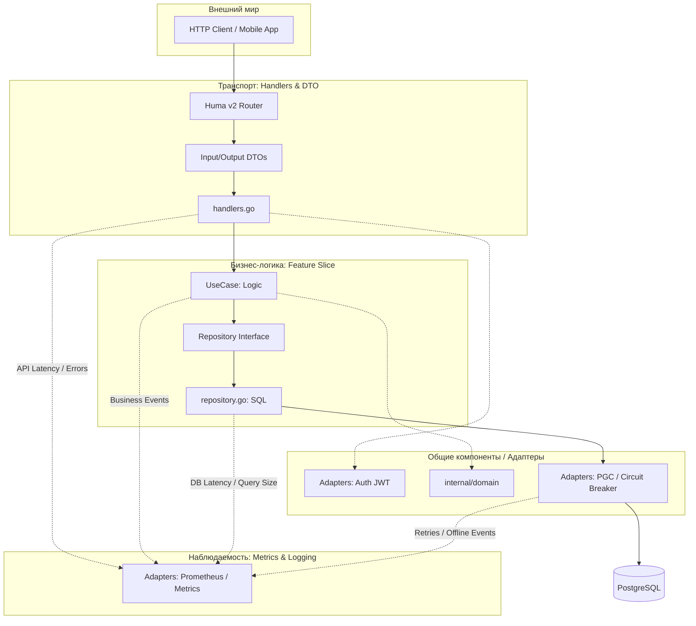

# Архитектура сервиса: Вертикальные слайсы и Observability

Сервис спроектирован по принципу **Vertical Slices**. Каждый функциональный блок (User, Orders, Loyalty) представляет собой независимый "вертикальный разрез" приложения, содержащий все слои: от API до SQL-запросов. 

## Вертикальная схема взаимодействия

## Описание слоев модели

1.  **API Layer (Handlers & DTO)**: 
    *   Принимает запросы, выполняет первичную валидацию (схемы JSON, заголовки).
    *   Превращает транспортные данные в доменные объекты.
    *   **Метрики**: HTTP коды ответов (2xx, 4xx, 5xx) и время обработки запроса.

2.  **UseCase Layer (Бизнес-логика)**: 
    *   Координирует выполнение задачи. Например, при входе пользователя проверяет пароль, обновляет сессию и генерирует JWT.
    *   **Метрики**: Количество успешных регистраций, объем списаний баллов.

3.  **Domain Layer (Ядро)**:
    *   Содержит типы-обертки (`Amount`, `OrderNumber`) и логику, не зависящую от внешних систем (например, алгоритм Луна или расчет копеек).

4.  **Data Layer (Repository & PGC)**:
    *   Инкапсулирует SQL-запросы. Использует **Circuit Breaker** (PGC) для защиты приложения от сбоев БД.
    *   **Метрики**: Время выполнения SQL-запросов, количество повторных попыток (Retries) при сетевых ошибках.

## Система сбора метрик (Observability)

Метрики пронизывают каждый слайс через интерфейсы. Это позволяет отслеживать здоровье сервиса в реальном времени:

| Слайс | Ключевые метрики | Зачем это нужно? |
| :--- | :--- | :--- |
| **User** | `BcryptDuration`, `AuthErrors` | Контроль нагрузки на CPU и детекция попыток брутфорса. |
| **Orders** | `OrderUploadStatus`, `ListSize` | Мониторинг коллизий номеров заказов и объема выборок из БД. |
| **Loyalty** | `WithdrawalAmount`, `InsufficientFunds` | Отслеживание финансовых потоков и частоты отказов в оплате. |
| **Database** | `ConnectionStatus`, `RetryCount` | Раннее оповещение о деградации сетевого соединения или БД. |

## Преимущества модели
*   **Изоляция**: Изменение логики начислений в слайсе `Loyalty` никак не затронет `User` или `Orders`.
*   **Гибкость**: Каждый слайс может иметь свои уникальные метрики, специфичные только для его бизнес-задачи.
*   **Надежность**: Благодаря слою `PGC`, приложение продолжает работать (отдавая данные из кеша или 503-ю ошибку), даже если БД временно недоступна.
