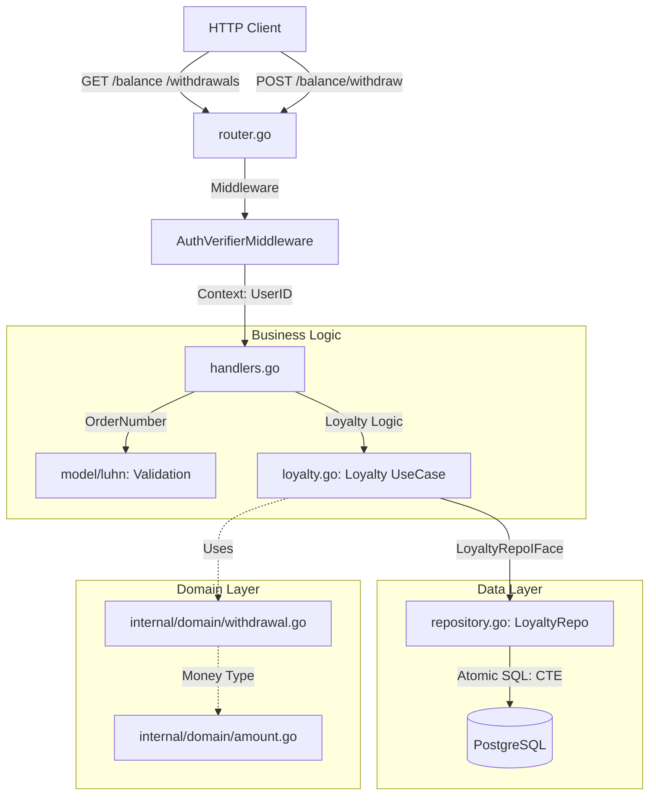

# Vertical Slice: Loyalty (Управление балансом и списаниями)

Этот модуль отвечает за финансовую составляющую системы: ведение текущего счета пользователя, регистрацию списаний баллов на оплату заказов и предоставление истории выводов средств.

## Архитектурная схема

## Состав модулей и их ответственность

### 1. [router.go](./router.go)
Определение API для финансовых операций.
*   `GET /api/user/balance` — запрос текущего состояния счета.
*   `POST /api/user/balance/withdraw` — инициация списания баллов.
*   `GET /api/user/withdrawals` — получение истории списаний.
*   Все маршруты закрыты авторизацией и требуют валидный JWT.

### 2. [handlers.go](./handlers.go)
Транспортный уровень и обработка HTTP-статусов.
*   **Balance**: Формирует ответ с разделением на текущий остаток (`current`) и общую сумму трат (`withdrawn`).
*   **Withdraw**: Обрабатывает специфичную бизнес-ошибку **402 Payment Required**, если у пользователя не хватает баллов.
*   **Withdrawals List**: Мапит пустую историю в статус **204 No Content**.

### 3. [loyalty.go](./loyalty.go)
UseCase слой, координирующий проверку данных.
*   Валидирует номер заказа для списания через алгоритм Луна перед обращением к БД.
*   Изолирует логику начислений от транспортного уровня.

### 4. [repository.go](./repository.go)
Низкоуровневая работа с балансами.
*   **Атомарные списания**: Использует продвинутый SQL-запрос (CTE), который за одну транзакцию проверяет баланс, создает запись о списании и обновляет агрегат в таблице `balances`. Это гарантирует отсутствие "двойных трат" (Double Spending).
*   **Data Integrity**: Баланс рассчитывается динамически как `accrual - withdrawn`, обеспечивая строгий аудит средств.

### 5. [internal/domain/withdrawal.go](../../domain/withdrawal.go)
Доменная модель списания.
*   Содержит номер заказа, сумму и метку времени выполнения операции.

## Особенности реализации
*   **Fixed-Point Arithmetic**: Все денежные операции проходят через тип `Amount` (хранение в копейках в `uint64`), что исключает потерю точности, присущую `float`.
*   **Atomic Transactions**: Списание баллов — самая чувствительная часть системы. Логика реализована на стороне БД в одном запросе, что исключает Race Condition без использования тяжелых блокировок в коде приложения.
*   **Zero-State Support**: Корректная обработка новых пользователей, у которых еще нет записей в таблице баланса (автоматический возврат `0` вместо ошибки).
