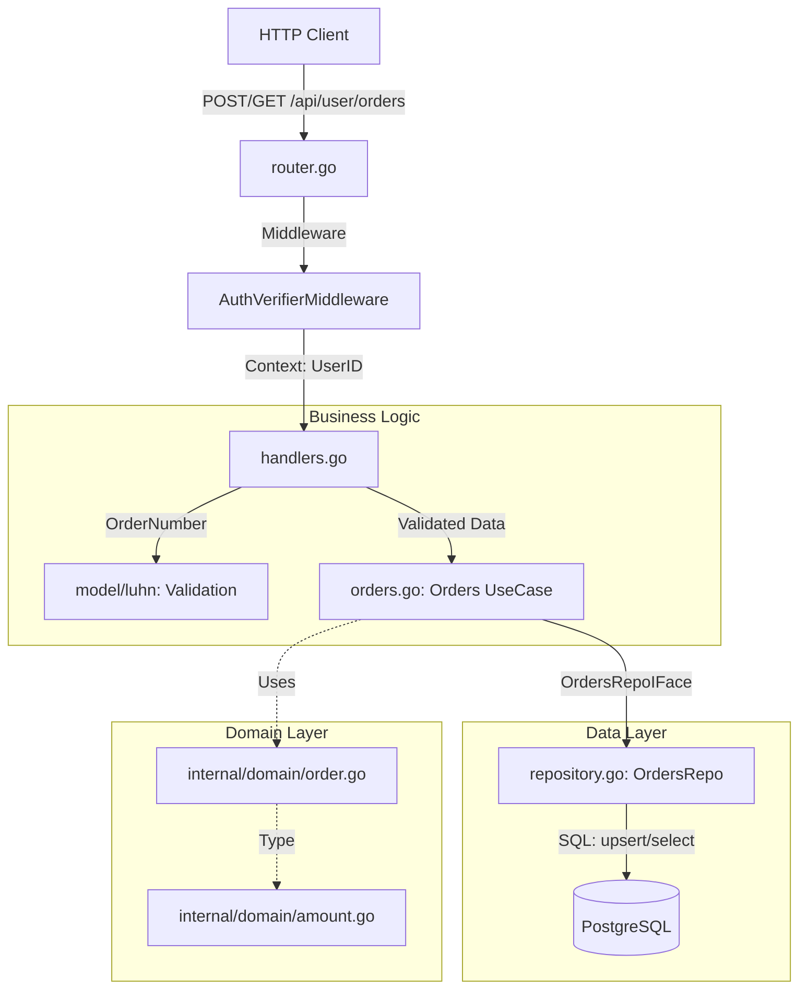

# Vertical Slice: Orders (Управление заказами)

Этот модуль отвечает за прием номеров заказов от пользователей, их первичную валидацию, хранение и предоставление истории заказов. Слайс интегрирован с системой авторизации через JWT и сессионные куки.

## Архитектурная схема

## Состав модулей и их ответственность

### 1. [router.go](./router.go)
Конфигурация эндпоинтов для работы с заказами.
*   Регистрирует `POST /api/user/orders` (загрузка) и `GET /api/user/orders` (список).
*   Применяет `AuthVerifierMiddleware` ко всем маршрутам, гарантируя наличие `UserID`.
*   Описывает схему безопасности `bearer` для OpenAPI.

### 2. [handlers.go](./handlers.go)
Адаптеры транспортного уровня.
*   **Загрузка**: Извлекает номер заказа из `RawBody`, проверяет его по алгоритму Луна (`luhn.IsValid`) и обрабатывает специфичные ошибки (конфликт владельца, повторная загрузка).
*   **Список**: Формирует ответ со списком заказов или возвращает `204 No Content`, если список пуст.

### 3. [orders.go](./orders.go)
Слой UseCase, реализующий бизнес-правила.
*   Оркестрирует процесс загрузки и получения данных.
*   Определяет интерфейс репозитория `OrdersRepoIFace` для обеспечения инверсии зависимостей.

### 4. [repository.go](./repository.go)
Реализация работы с базой данных.
*   **Атомарность**: Использует сложный SQL-запрос с `WITH` и `ON CONFLICT`, чтобы за одно обращение к БД определить статус загрузки (новый заказ, свой дубликат или чужой конфликт).
*   **Метрики**: Отслеживает количество новых заказов, конфликтов и время выполнения запросов.

### 5. [internal/domain/amount.go](../../domain/amount.go)
Специализированный тип для финансовых расчетов.
*   Хранит сумму в `uint64` (в копейках) для исключения ошибок округления `float64`.
*   Реализует кастомный `MarshalJSON/UnmarshalJSON` для прозрачной работы с рублями в API.

## Особенности реализации
*   **Luhn Validation**: Номера заказов проверяются на корректность контрольной суммы до попадания в базу данных.
*   **Status Management**: Поддержка жизненного цикла заказа (`NEW`, `PROCESSING`, `INVALID`, `PROCESSED`).
*   **Concurrency Safe**: Корректная обработка одновременной загрузки одного и того же номера разными пользователями на уровне ограничений БД.
*   **Performance**: Сортировка заказов по времени загрузки (`DESC`) выполняется на стороне БД с использованием индексов.
