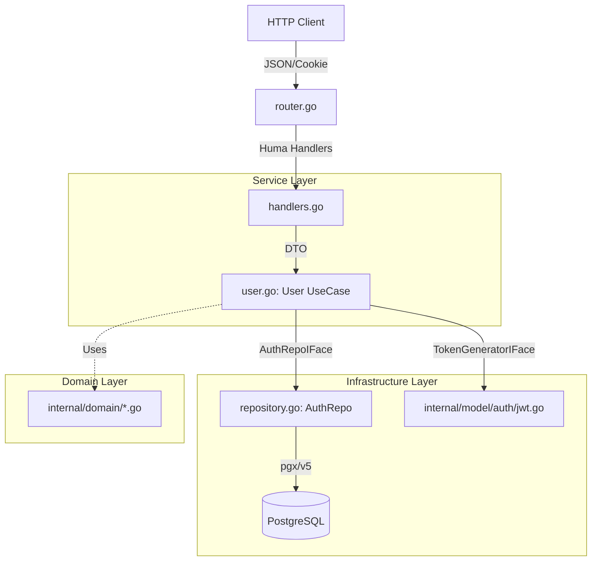
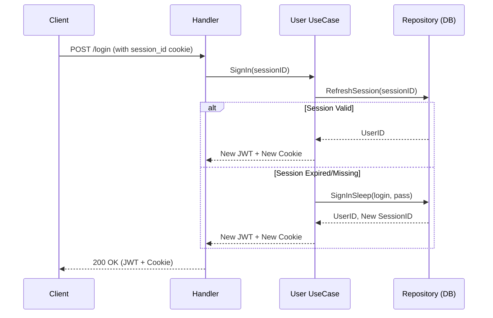
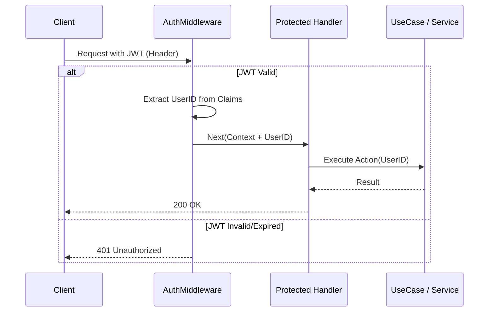

# Vertical Slice: User (Authentication & Authorization)

Данный пакет реализует вертикальный слайс функциональности пользователя: от сетевых интерфейсов (HTTP/gRPC) до хранения данных в PostgreSQL. Слайс спроектирован по принципам чистой архитектуры с четким разделением ответственности.

## Архитектурная схема

## Состав модулей и их ответственность

### 1. [router.go](./router.go) (API Definition)
Декларативное описание API с использованием фреймворка **Huma v2**.
*   Регистрация маршрутов `POST /api/user/register` и `POST /api/user/login`.
*   Генерация спецификации OpenAPI/Swagger.
*   Определение кодов ответов (200, 401, 409, 500).

### 2. [handlers.go](./handlers.go) (Transport Layer)
Слой адаптеров для работы с HTTP-запросами.
*   **DTO (Data Transfer Objects)**: Описание структур `signUpInput`, `signInInput` и `signOutput` с тегами валидации (`minLength`, `pattern`).
*   **Валидация**: Автоматическая проверка входных данных через Huma.
*   **Маппинг ошибок**: Преобразование доменных ошибок (например, `ErrUserNotFound`) в HTTP-статусы.

### 3. [user.go](./user.go) (Application/UseCase Layer)
Ядро бизнес-логики (координатор).
*   **SignIn Logic**: Реализует "быстрый вход" (Fast Track) через проверку `SessionID` в куках или полный вход через логин/пароль.
*   **Orchestration**: Связывает репозиторий для проверки данных и генератор токенов для создания ответа.
*   **Security**: Формирует защищенные HTTP-Only куки.

### 4. [repository.go](./repository.go) (Data Access Layer)
Низкоуровневая работа с хранилищем данных.
*   **SQL Запросы**: Инкапсуляция логики вставки и поиска в таблицах `users` и `sessions`.
*   **Bcrypt**: Хеширование и проверка паролей.
*   **Timing Attack Protection**: Метод `SignInSleep` выравнивает время ответа сервера, чтобы злоумышленник не мог перебором определить существующие логины.
*   **Circuit Breaker Integration**: Работа через `pgc.PgInstance` для обеспечения отказоустойчивости.

### 5. Механизм авторизации (JWT + Sessions)

Система использует комбинированный подход для баланса между безопасностью и удобством:

*   **Короткоживущий JWT (Access Token)**: Выдается в заголовке `Authorization` при успешном `SignIn` или `SignUp`. Предназначен для авторизации на защищенных эндпоинтах (через Middleware). Имеет короткий срок жизни для минимизации ущерба при компрометации.
*   **Долгоживущая сессионная кука (Refresh Session)**: Устанавливается как `HttpOnly`, `Secure` кука `session_id`. Хранится в БД в таблице `sessions`.
*   **Бесшовное обновление (Silent Refresh)**: 
    *   При вызове `SignIn` сервис первым делом проверяет наличие и валидность `session_id`.
    *   Если сессия в БД активна, `User` автоматически перевыпускает новый JWT без повторного ввода логина/пароля.
    *   Это позволяет пользователю оставаться авторизованным, пока его сессия валидна, при этом используя безопасные краткосрочные токены для каждого запроса.

### 6. Middleware и авторизация запросов

Для защиты остальных эндпоинтов системы используется `AuthVerifierMiddleware` из пакета `internal/model/auth`. 

**Принцип работы:**
1.  **Извлечение**: Middleware перехватывает заголовок `Authorization: Bearer <JWT>`.
2.  **Верификация**: Проверяет подпись (HMAC или RSA), срок жизни (`exp`) и структуру `Claims`.
3.  **Контекст**: При успешной проверке `UserID` извлекается из токена и сохраняется в контексте запроса (`huma.WithValue`).
4.  **Безопасность**: Если токен невалиден или просрочен, Middleware немедленно прерывает цепочку вызовов и возвращает **401 Unauthorized**, не нагружая бизнес-логику.

> **Важно:** Благодаря тому, что JWT содержит `UserID` внутри себя (self-contained), Middleware не делает лишних запросов в базу данных при каждом обращении к защищенным ручкам, что значительно снижает задержки (Latency).

## Ключевые особенности
*   **Security First**: Защита от Timing Attacks, использование Bcrypt с адаптивной задержкой, Secure/HttpOnly сессионные куки.
*   **Observability**: Интеграция с метриками (`AuthMetrics`) для отслеживания ошибок авторизации и производительности Bcrypt.
*   **Testability**: Все зависимости вынесены в интерфейсы (`AuthRepoIFace`, `TokenGeneratorIFace`), что позволяет генерировать моки одной командой 'go generate'.
*   **Resilience**: Использование `context` для таймаутов и поддержка транзакционной целостности при создании пары Пользователь-Сессия.
