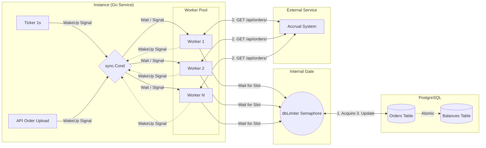

# Модуль фоновой обработки (Accrual Workers)

Модуль предназначен для автоматического обновления статусов заказов и начисления баллов лояльности путем взаимодействия с внешним сервисом расчета (```Accrual Service```).

## Архитектура и ключевые решения

### 1. Механика "Умного пробуждения" через ```sync.Cond```
Вместо постоянного опроса базы данных (polling), нагружающего CPU и I/O, воркеры используют ```sync.Cond``` для перехода в режим ожидания.
- **Дежурный Ticker (1 сек)**: Раз в секунду тикер отправляет на «разведку» в БД **только одного** воркера (```Signal```), а не всю толпу сразу. Это минимизирует холостую нагрузку на базу при пустой очереди.
- **Цепочка пробуждений (WakeUp)**: Если «разведчик» нашел работу и успешно выполнил ```doWork```, он сигнализирует следующему свободному воркеру. Это позволяет пулу мгновенно наращивать мощность до максимума, когда в очереди появляется много задач.
- **API Trigger**: При загрузке пользователем нового заказа через API, система также подает сигнал воркерам начать обработку немедленно.

### 2. Защита базы данных (Database Semaphore)
Для предотвращения "шторма" запросов к PostgreSQL при большом количестве запущенных воркеров используется внутренний лимитер (```dbLimiter```).
- Реализован на базе **buffered channel** (семафор).
- Ограничивает количество **одновременных активных сеансов** с БД от одного инстанса сервиса.
- Даже если в пуле 100 воркеров, в базу одновременно пойдут только N (согласно конфигу), остальные подождут освобождения слота в неблокирующем ```select```.

### 3. Атомарность и Идемпотентность (Database-First)
Логика начисления баллов вынесена на уровень базы данных через сложный **CTE (Common Table Expression)** запрос.
- Статус заказа и баланс пользователя обновляются **в одной транзакции**.
- Идемпотентность гарантируется условием ```WHERE accrual = 0```. Если баллы уже были начислены другим инстансом, база не обновит строку, исключая риск двойного начисления.

### 4. Распределенная блокировка через ```SKIP LOCKED```
Для выбора задач используется конструкция ```FOR UPDATE SKIP LOCKED```. 
- Это позволяет нескольким воркерам (даже на разных физических серверах) работать с одной таблицей без конфликтов.
- Каждый воркер "бронирует" себе заказ, обновляя ```accrualed_at```, что делает его невидимым для других на время обработки.

### 5. Умная обработка лимитов (CAS-loop)
При получении ошибок ```429 Too Many Requests``` или ```500 Internal Error```, воркеры уходят в "сон". 
- Время сна управляется атомарно через **CAS (Compare-And-Swap) цикл**. 
- Это гарантирует, что время ожидания в инстансе будет только расти до максимального полученного значения, и «быстрые» ошибки не собьют серьезные ограничения (Retry-After) от сервера.

---

## Схема работы



---

## Почему выбрана автономная модель вместо Диспетчера?

В процессе проектирования рассматривался вариант с **Центральным Диспетчером**, который читает пачку джобов из БД и раздает их воркерам по каналам. Выбор был сделан в пользу автономных воркеров по следующим причинам:

1. **Проблема распределения между инстансами**:
   Наш сервис горизонтально масштабируем. С одной БД может работать 5-10 инстансов сервиса одновременно. Если бы мы реализовали диспетчера внутри процесса, нам все равно пришлось бы решать задачу координации **между диспетчерами** разных инстансов, чтобы они не читали одни и те же данные.

2. **База данных как Брокер**:
   Использование ```SKIP LOCKED``` в PostgreSQL превращает саму БД в надежный распределенный брокер сообщений. Это избавляет от необходимости внедрять Redis или RabbitMQ для координации задач.

3. **Устойчивость (Resilience)**:
   В модели с диспетчером его падение парализует весь инстанс. В автономной модели смерть одного воркера никак не влияет на остальных.

4. **Локальный лимитер (dbLimiter)**:
   Чтобы автономные воркеры не "заспамили" БД запросами, используется семафор на каналах, ограничивающий количество одновременных активных подключений к PostgreSQL от одного инстанса.

---

## Технический стек
- **Concurrency**: ```sync.Cond```, ```sync.WaitGroup```, ```atomic (CAS)```.
- **Network**: ```http.Client``` с настроенным ```MaxIdleConnsPerHost``` для поддержания Keep-Alive.
- **Database**: PostgreSQL (CTE, UPSERT, SKIP LOCKED).

